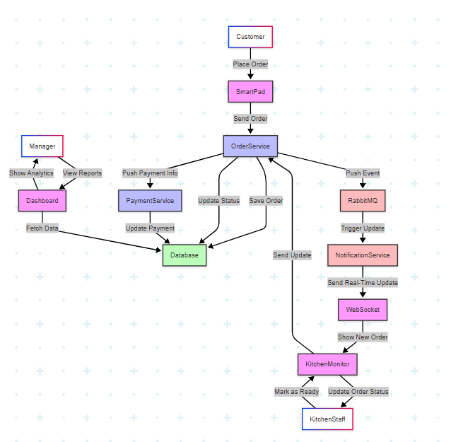
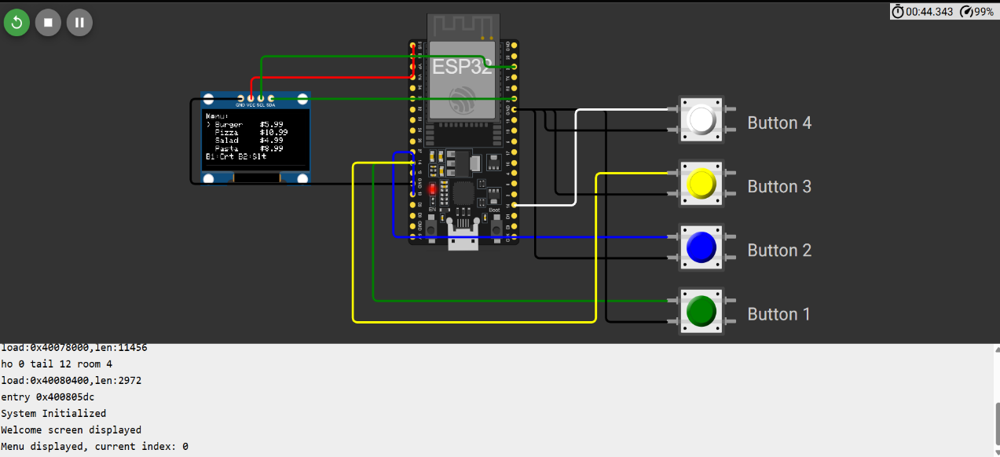
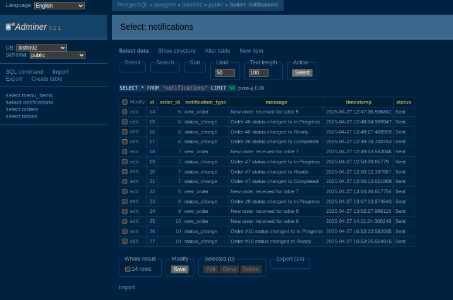
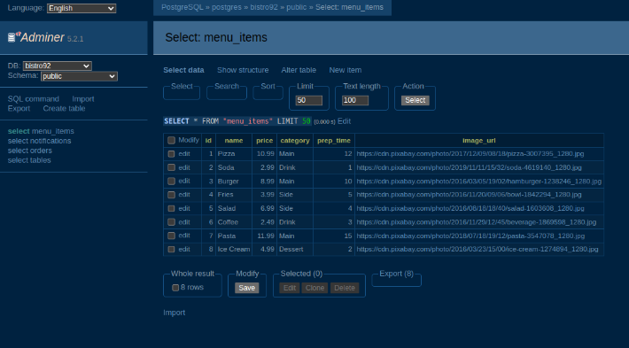

# Bistro-92

Bistro-92 is a modern restaurant management system that combines Go microservices, a React frontend, and event-driven workflows to power ordering, notifications, and analytics.

## Highlights

- Microservices for orders, notifications, and dashboards
- Real-time updates via WebSockets, RabbitMQ, and Temporal workflows
- PostgreSQL + Redis for persistence and caching
- React UI with charts and dashboards
- Docker Compose for one-command local setup

## Architecture & Workflows




## UI Preview





## For Beginners (Quick Start)

### Prerequisites

- Docker + Docker Compose
- Git

### Run the full stack

```bash
git clone https://github.com/MD-Junayed000/Bistro-92.git
cd Bistro-92

docker-compose up -d
```

### Open the apps

- Frontend: http://localhost:3000
- Order Service API: http://localhost:8000
- Notification Service API: http://localhost:3001
- Dashboard Service API: http://localhost:5000
- RabbitMQ Management: http://localhost:15672 (guest/guest)
- Temporal UI: http://localhost:8085
- Adminer (DB UI): http://localhost:4040

### Reset the database (optional)

```bash
docker-compose exec postgres psql -U postgres -d bistro92 -f /docker-entrypoint-initdb.d/init.sql
```

## For Developers (Local Development)

### Tech stack

- Go 1.23 (Gin, Temporal SDK)
- React 18 (React Router, Chart.js, Bootstrap)
- PostgreSQL, Redis, RabbitMQ
- Docker & Docker Compose

### Repository structure

```
.
├── assets/                     # Architecture + UI images
├── bistro92-backend/
│   ├── order-service/          # Orders, menu, tables
│   ├── notification-service/   # WebSocket + RabbitMQ notifications
│   └── dashboard-service/      # Metrics + Redis cache
├── frontend/                   # React UI
└── docker-compose.yml          # Local environment
```

### Local workflow

1. Start the infrastructure (recommended):
   ```bash
   docker-compose up -d postgres rabbitmq redis temporal temporal-ui adminer
   ```
2. Run the backend services with Docker (simple):
   ```bash
   docker-compose up -d --build order-service notification-service dashboard-service
   ```
3. Run the frontend locally (hot reload):
   ```bash
   cd frontend
   npm install
   npm start
   ```

> The Go services are configured to connect to Docker Compose hostnames (postgres, rabbitmq, temporal, redis). If you run them outside Docker, update the connection strings or map those hostnames locally.

### Service ports

| Service | Port | Notes |
| --- | --- | --- |
| Frontend | 3000 | React UI |
| Order Service | 8000 | REST API |
| Notification Service | 3001 | WebSocket + REST |
| Dashboard Service | 5000 | Metrics API |
| PostgreSQL | 5432 | Database |
| RabbitMQ | 5672 / 15672 | Broker + management UI |
| Redis | 6379 | Cache |
| Temporal | 7233 / 8085 | Workflow engine + UI |
| Adminer | 4040 | DB browser |

### Database schema

The schema lives at `bistro92-backend/order-service/db/schema.sql` and is mounted into the PostgreSQL container during startup.

## Services at a Glance

- **Order Service**: Menu, table, and order lifecycle endpoints; persists to PostgreSQL and emits events.
- **Notification Service**: Consumes RabbitMQ events, triggers Temporal workflows, and pushes WebSocket notifications.
- **Dashboard Service**: Aggregates metrics, caches results in Redis, and serves analytics endpoints.
- **Frontend**: Customer + staff UI with charts and operational views.
